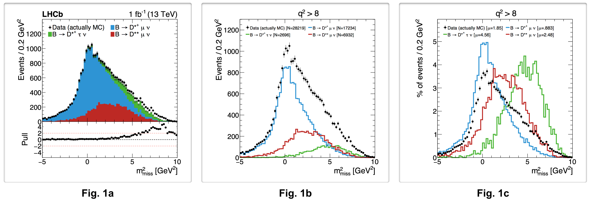
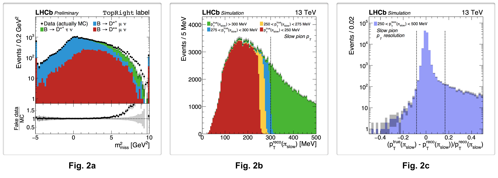
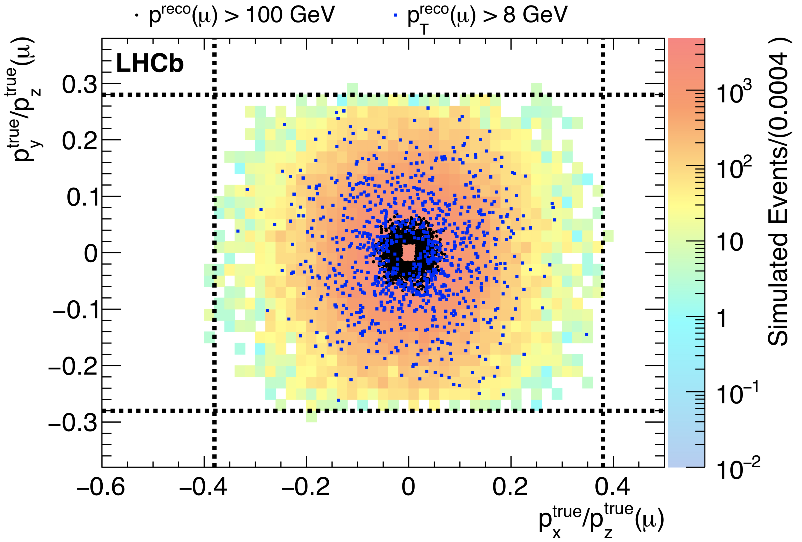

plot_scripts
========

Repository for LHCb analysis plotting and table-making utilities. The package allows to easily define
the format of plots and load the appropriate ntuple with selected cuts and weights.

Cuts and weights can be provided with strings similar to those used by ROOT, eg `mu_P/1000 > 3 && mu_PT/1000 > 0.5`. 
Arithmetic and logical operators, parentheses, and vector operations are implemented. Other features such as 
functions, eg `log()` or `abs()`, may come in the future. But they can be provided directly with `NamedFunc` 
functions, described below. These all rely on defining the branch structure beforehand in 
[txt/variables](https://github.com/umd-lhcb/plot_scripts/tree/master/txt/variables). 

Originally created by Adam Dishaw at [https://github.com/richstu/ra4_draw](https://github.com/richstu/ra4_draw).


## Setup and overview
Compilation requires `c++11` and `ROOT 6`. To compile it and run a minimal example, type in your terminal

    ./compile.py && ./run/core/minimal_example.exe
    
The `&&` simply concatenates commands if the
first was successful. You will obtain a cute little plot `plots/FitVar_Mmiss2d1000000__sigontop_lin.pdf`
based on a small ntuple committed with the project. In general, the scripts in this repo rely on the ntuples
that are in the [lhcb-ntuples-gen](https://github.com/umd-lhcb/lhcb-ntuples-gen) project, downloaded
with `git annex`. See the [RD(*) wiki](https://umd-lhcb.github.io/lhcb-ntuples-gen/ntupling/installation/)
for installation instructions. The figures included in this README were generated with
[src/rdx/example_plots_tables.cxx](https://github.com/umd-lhcb/plot_scripts/blob/master/src/rdx/example_plots_tables.cxx)
which uses this [576 MB ntuple](https://github.com/umd-lhcb/plot_scripts/blob/1345c0fba43e3ab4a0a7f78053bdb5181cfc8e92/src/rdx/example_plots_tables.cxx#L82-L83).

Let us look at the code in 
[src/core/minimal_example.cxx](https://github.com/umd-lhcb/plot_scripts/blob/master/src/core/minimal_example.cxx)

```c++
  // Defining plot styles
  PlotOpt lin_lumi("txt/plot_styles.txt", "LHCbPaper");
  lin_lumi.Title(TitleType::data).Bottom(BottomType::ratio).Stack(StackType::signal_on_top);
  vector<PlotOpt> plottypes = {lin_lumi};
  Palette colors("txt/colors.txt", "default");

  // Defining processes (plot components)
  string ntuple = "various/ntuples/Dst--20_04_20--cutflow_mc--cocktail--2016--md--dv45-subset.root";
  vector<shared_ptr<Process> > procs;
  procs.push_back(Process::MakeShared<Baby_run2>("Data (actually MC)",Process::Type::data, colors("data"),
                                                 set<string>({ntuple}), "1"));
  procs.push_back(Process::MakeShared<Baby_run2>("MC: q^{2} < 7 GeV^{2}", Process::Type::background, colors("blue"),
                                                 set<string>({ntuple}), "FitVar_q2/1000000<7"));
  procs.push_back(Process::MakeShared<Baby_run2>("MC: q^{2} > 7 GeV^{2}", Process::Type::background, colors("green"),
                                                 set<string>({ntuple}), "FitVar_q2/1000000>7"));

  // Making plots. Missing mass plot is set to GeV^2 by dividing by 1e6
  PlotMaker pm;
  pm.Push<Hist1D>(Axis(75, -5, 10,"FitVar_Mmiss2/1000000", "m_{miss}^{2} [GeV^{2}]"), "1", procs, plottypes);
  pm.MakePlots(1); // The "1" is the luminosity scaling
```

The main components are
- **`PlotOpt`**: defines the overall plot style. We store the basic format for various plots in 
[txt/plot_styles.txt](https://github.com/umd-lhcb/plot_scripts/blob/master/txt/plot_styles.txt)
and it can be further tweaked in the code as shown. Some of the options are
- **`Process`**: the various components in the plots as defined by the label in the legend, color, ntuples, and cuts
- **`PlotMaker`**: the class that contains all the plots to be made. Plots, tables, and pie charts are pushed into one of this
- **`Hist1D`**: 1D histograms, one of the types of objects that can be pushed into `Plotmaker`

This plot uses an ntuple of type `Baby_run2`, whose branches and types are defined in 
[txt/variables/run2](https://github.com/umd-lhcb/plot_scripts/blob/master/txt/variables/run2). This file
can be generated for new ntuples using the [ntpdump script](https://pybabymaker.readthedocs.io/en/latest/scripts/ntpdump.html).

## 1D plots

The image below shows three examples that illustrate the main ways of stacking the different components in the plot as well as some of
the possible formatting options



### Main `PlotOpt` options (plot styles)

The plot styles are the first things to be defined. As shown in the minimal example above, you set the style by creating a `PlotOpt` object typically based on one of the standard formats defined in [txt/plot_styles.txt](https://github.com/umd-lhcb/plot_scripts/blob/master/txt/plot_styles.txt). These set the font types and sizes for titles, labels, and legends, offsets, and canvas dimensions. 

You typically define one `PlotOpt` object, and make others based on that one. You then put them into a vector and pass it to the `PlotMaker`, which then creates one plot per style. For instance, 

```c++
  PlotOpt lin_lumi("txt/plot_styles.txt", "LHCbPaper");
  lin_lumi.Title(TitleType::data).Bottom(BottomType::pull).YAxis(YAxisType::linear).Stack(StackType::signal_on_top);
  PlotOpt log_lumi = lin_lumi().YAxis(YAxisType::log).Bottom(BottomType::ratio).Overflow(OverflowType::none);
  PlotOpt lin_shapes = lin_lumi().Stack(StackType::shapes).Title(TitleType::info).Bottom(BottomType::off);
  
  vector<PlotOpt> plottypes = {lin_lumi, log_lumi, lin_shapes};
```

The full list of options is in [inc/core/plot_opt.hpp](https://github.com/umd-lhcb/plot_scripts/blob/master/inc/core/plot_opt.hpp). Key options defined with `enum` in the `c++` code are:

- **`Stack`**:  Determines how the plot components stack. Except in `shapes`, the data is always plotted with weight 1. The MC is normalized by the luminosity passed to the `PlotMaker` and the even weights which account for cross section, fragmentation fraction, and branching fraction among others. These should be normalized so that they correspond to 1 ifb.
  - `StackType::signal_on_top` (**Fig. 1a**): stacks the `background` components with the `signal` on top, and compares this that stack to the data on
    their own.
  - `StackType::lumi_shapes` (**Fig. 1b**):  compares the unstacked distributions.
  - `StackType::shapes` (**Fig. 1c**):  compares the unstacked distributions all normalized to 1.
  - `StackType::data_norm`:  stacks the `background` components and normalizes the stack to the number of events in data. Useful when the overall shape of the background is expected to be correct but the normalization may be off due to not knowing the luminosity, trigger efficiency, or others.
  - `StackType::signal_overlay`:  stacks the `background` components and compares this that stack to the data on their own. The signal is overlaid on its own in an unfilled histogram. This option was useful in the searches for SUSY where the signal is not expected to exist, but not so much for LHCb.
- **`Bottom`**: Adds a bottom plot with the ratio, difference, or pull of the histograms above. Types are `BottomType{off, ratio, diff, pull}`.
- **`Title`**: Determines how much information is printed on the plot. Types are `TitleType{data, info, preliminary, simulation, simulation_preliminary, simulation_supplementary, supplementary}`
  - `TitleType::data` has a nice format and minimal information, so it is the standard type for plots going to a paper
  - `TitleType::info` shows the cuts at the top and the yields (or average for `shapes`) of the distributions in the legend. This is the preferred option for working plots. The replacements of branch names to make the cuts more readable are in [src/core/utilities.cpp](https://github.com/umd-lhcb/plot_scripts/blob/6df867454af67d316641d91749e9c85b49b19727/src/core/utilities.cpp#L137-L146).
- **`YAxis`**: Sets the Y axis scale to `YAxisType{linear, log}`
- **`Overflow`**: Determines whether to include the events outside of the X axis (under/overflows). Types are `OverflowType{none, underflow, overflow, both}`.


### Main `Process` options (plot components)

Each `Process` object is pushed into a vector to define a plot component. They are of one of the types define by the tree structures in 
[txt/variables](https://github.com/umd-lhcb/plot_scripts/tree/master/txt/variables). The full list of options is in [inc/core/process.hpp](https://github.com/umd-lhcb/plot_scripts/blob/master/inc/core/process.hpp). The input arguments are
- **Legend title**: it uses standard ROOT LaTeX
- **Process type**: there are three types
  - `Process::Type::data`: plotted with markers and compared in ratio/pull plots to the sum of `background` plus `signal` components.
  - `Process::Type::background`: plotted with solid histograms and stacked with other `background` and `signal` components.
  - `Process::Type::signal`: same as `background` except in `StackType::signal_overlay` and in tables.
- **Color**: an integer, a ROOT defined color like `kBlack`, or a user RGB-defined color in [txt/colors.txt](https://github.com/umd-lhcb/plot_scripts/blob/master/txt/colors.txt) like `colors("data")`.
- **Ntuple file names**: list of files to load trees from. It accepts wildcards on the file names but not on the folders. Repeated files are suppressed thanks to `std::set`.
- **Selection cuts**: selects a subset of the events in the loaded files. These cuts do not get printed anywhere (plot file name or title with `TitleType::info`, so beware.

For instance, here we use the same ntuple to define three components: muons at high `p`, muons at high `pT`, and all muons:

```c++
  string repofolder = "ntuples/";
  string run2bare = "0.9.0-cutflow/Dst-cutflow_mc/Dst--20_06_05--cutflow_mc--bare--MC_2016_Beam6500GeV-2016-MagDown-Nu1.6-25ns-Pythia8_Sim09b_Trig0x6138160F_Reco16_Turbo03_Stripping26NoPrescalingFlagged_11874091_ALLSTREAMS.DST.root";
  auto mup_high = Process::MakeShared<Baby_run2_bare>("p^{reco}(#mu) > 100 GeV", Process::Type::data, kBlack,
                                                      set<string>({repofolder+run2bare}), "mu_P>100000");
  auto mupt_high = Process::MakeShared<Baby_run2_bare>("p^{reco}_{T}(#mu) > 8 GeV", Process::Type::data, kBlue,
                                                       set<string>({repofolder+run2bare}), "mu_PT>8000");
  auto all_mu = Process::MakeShared<Baby_run2_bare>("MC", Process::Type::background, kBlack,
                                                    set<string>({repofolder+run2bare}), "1");
  mup_high->SetMarkerStyle(20);  mup_high->SetMarkerSize(0.4);
  mupt_high->SetMarkerStyle(21); mupt_high->SetMarkerSize(0.4);
  
  vector<shared_ptr<Process> > procs_mu = {mup_high, mupt_high, all_mu};
```

### Main `Hist1D` options

The `Hist1D` objects are pushed into a `PlotMaker` and generate one plot per plot style defined by the vector of `PlotOpt`. Input arguments for the standard constructor are:
- **X axis**: An `Axis` object with the constructor `Axis(std::size_t nbins, double xmin, double xmax, const NamedFunc &var, const std::string &title = "", const std::set<double> &cut_vals = {})`
  - `var` is the variable to plot.
  - `cut_vals` is an optional argument with the positions of dashed vertical lines to be drawn on plot, typically indicated some sort of possible cut.
- **Selection cuts**: cuts applied to all components in plot, shown in the title when `TitleType::info` is selected and used to form the name of the plot file. 
- **List of `Process`**: plot components to be included.
- **List of `PlotOpt`**: plot styles to be used. Produces one file per style.

The full list of options is in [inc/core/hist1d.hpp](https://github.com/umd-lhcb/plot_scripts/blob/master/inc/core/hist1d.hpp).
Some of these options are illustrated below



```c++
  pm.Push<Hist1D>(Axis(75, -5, 10,"FitVar_Mmiss2/1000000", "m_{miss}^{2} [GeV^{2}]"), "FitVar_q2/1000000>8",
                  procs_mm, plottypes).Tag("example").TopRight("#font[82]{TopRight} label").RatioTitle("Fake data","MC");
  pm.Push<Hist1D>(Axis(100, 0, 500,"spi_PT", "p_{T}^{reco}(#pi_{slow}) [MeV]",{300}), "spi_TRUEPT>0",
                  procs_comp_spi,plottypes_spi).TopRight("13 TeV").RightLabel({"Slow pion p_{T}"});
  pm.Push<Hist1D>(Axis(50, -0.5, 0.5,"(spi_TRUEPT-spi_PT)/spi_PT", "(p_{T}^{true}(#pi_{slow}) - p_{T}^{reco}(#pi_{slow}))/p_{T}^{reco}(#pi_{slow})",{-25/300., 50/300.}),
                  "1", procs_low_spi, plottypes_spi).TopRight("13 TeV").LeftLabel({"Slow pion", "p_{T} resolution"});

```

Some of the key options that can be changed as it is being pushed to `PlotMaker` are:
- **`Weight`**: the weight to be used for the `backgroung` and `signal` components as a string or `NamedFunc`, eg, `weight_pid/1000`.
- **`Tag`**: additional string added to the plot filename to label it or to make it different from other plots being created at the same time. The latter is an issue when you are making plots with the same X-axis variable and cuts, but different binnings or processes, because the latter are not registered in the file name.
- **`TopRight`**: text to be added to the top right of the plot when not in `TitleType::info`. By default it is set to luminosity (energy), eg `1 ifb (13 TeV)`.
- **`LeftLabel`** and **`LeftLabel`**: Labels added below the legend. Input is a vector of `string` that are placed on top of each other.
- **`YAxisZoom`**: changes the Y-axis scale. It is set by default to include all distributions without clipping
- **`RatioTitle(num, den)`**: title to be used in the bottom plot containing the ratio.


## 2D plots

Many of the options used to build a `Hist2D` are the same as those described above for the `Hist1D`, except that `Hist2D` takes two `Axis` and that you should define the marker properties on the processes. Here is an example



```c++
  pm_mu.Push<Hist2D>(Axis(55, -0.6, 0.5, "mu_TRUEP_X/mu_TRUEP_Z", "p_{x}^{true}/p_{z}^{true}(#mu)", {-0.38, 0.38}),
                  Axis(38, -0.38, 0.38, "mu_TRUEP_Y/mu_TRUEP_Z", "p_{y}^{true}/p_{z}^{true}(#mu)", {-0.28, 0.28}),
                  "1", procs_mu, scattertype).TopRight("");
```

The optional underlying histogram is typically used to show how the background is expected to be distributed. The markers on the top are often the actual data. **BEWARE**, the plot is saved by default as `.pdf` file, so the location of each marker is kept in the file. If you plot many events in the scatter plot, the file can be huge and unmanageable. This is not an issue for the underlying histogram.

## Event scans

This functionality emulates ROOT's `TTree::Scan` but with the added power of user-defined functions via `NamedFunc`, the ability to quickly print all events to a file, and the flexibility of having it in the same package as your plots and tables.

For example, the code below prints to a file the run and event numbers as well as the MC IDs of various particles for all events with missing mass greater than 8 GeV^2 that are not truthmatched to signal, normalization, or D**.

```c++
  pm_mm.Push<EventScan>("eventscan", !is_dsptau && !is_dspmu && !is_dss && "FitVar_Mmiss2/1000000 > 8", 
                        vector<NamedFunc>{"runNumber", "eventNumber", "mu_MC_MOTHER_ID", "d0_MC_MOTHER_ID",
                                            "d0_MC_GD_MOTHER_ID", "d0_MC_GD_GD_MOTHER_ID"}, procs_mm).Precision(10);
```

The `Precision` option controls the digits of precision for `float` variables and the width of the columns. The [output file](https://github.com/umd-lhcb/plot_scripts/blob/master/various/eventscan_SCAN_DataactuallyMC.txt) contains lists the values of the selected variables for all 287 events that pass the selection:

```
      Row        runNumber      eventNumber  mu_MC_MOTHER_ID  d0_MC_MOTHER_ID d0_MC_GD_MOTHER_ d0_MC_GD_GD_MOTH
        0          5616918            70792              221             -413              511              513
        1          5616835             3433              521             -413           -10413             -511
        2          5616942            84858              313              413              511              513
        3          5616942            84858              313              413              511              513
        4          5617022           132703              211             -413              511              513
      ...
```
