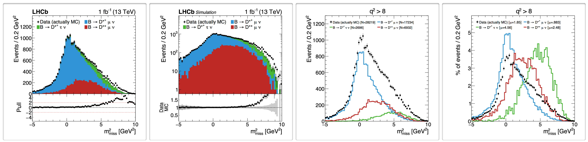

plot_scripts
========

Repository for LHCb analysis plotting and table-making utilities. The package allows to easily define
the format of plots and load the appropriate ntuple with selected cuts and weights.

Cuts and weights can be provided with strings similar to those used by ROOT, eg `mu_P/1000 > 3 && mu_PT/1000 > 0.5`. 
Arithmetic and logical operators, parentheses, and vector operations are implemented. Other features such as 
functions, eg `log()` or `abs()`, may come in the future. But they can be provided directly with `NamedFunc` 
functions, described below. These all rely on defining the branch structure beforehand in 
[txt/variables](https://github.com/umd-lhcb/plot_scripts/tree/master/txt/variables). 

Based on https://github.com/richstu/ra4_draw


## Setup and overview
Compilation requires `c++11` and `ROOT 6`. To compile it and run a minimal example, type in your terminal

    ./compile.py && ./run/core/minimal_example.exe
    
The `&&` simply concatenates commands if the
first was successful. You will obtain a cute little plot `plots/FitVar_Mmiss2d1000000__sigontop_lin.pdf`
based on a small ntuple committed with the project. In general, the scripts in this repo rely on the ntuples
that are in the [lhcb-ntuples-gen](https://github.com/umd-lhcb/lhcb-ntuples-gen) project, downloaded
with `git annex`. See the [RD(*) wiki](https://umd-lhcb.github.io/lhcb-ntuples-gen/ntupling/installation/)
for installation instructions. The figures included in this README were generated with
[src/rdx/example_plots_tables.cxx](https://github.com/umd-lhcb/plot_scripts/blob/master/src/rdx/example_plots_tables.cxx)
which uses this [576 MB ntuple](https://github.com/umd-lhcb/plot_scripts/blob/1345c0fba43e3ab4a0a7f78053bdb5181cfc8e92/src/rdx/example_plots_tables.cxx#L82-L83).

Let us look at the code in 
[src/core/minimal_example.cxx](https://github.com/umd-lhcb/plot_scripts/blob/master/src/core/minimal_example.cxx)

```c++
  // Defining plot styles
  PlotOpt lin_lumi("txt/plot_styles.txt", "LHCbPaper");
  lin_lumi.Title(TitleType::data).Bottom(BottomType::ratio).Stack(StackType::signal_on_top);
  vector<PlotOpt> plottypes = {lin_lumi};
  Palette colors("txt/colors.txt", "default");

  // Defining processes (plot components)
  string ntuple = "various/ntuples/Dst--20_04_20--cutflow_mc--cocktail--2016--md--dv45-subset.root";
  vector<shared_ptr<Process> > procs;
  procs.push_back(Process::MakeShared<Baby_run2>("Data (actually MC)",Process::Type::data, colors("data"),
                                                 set<string>({ntuple}), "1"));
  procs.push_back(Process::MakeShared<Baby_run2>("MC: q^{2} < 7 GeV^{2}", Process::Type::background, colors("blue"),
                                                 set<string>({ntuple}), "FitVar_q2/1000000<7"));
  procs.push_back(Process::MakeShared<Baby_run2>("MC: q^{2} > 7 GeV^{2}", Process::Type::background, colors("green"),
                                                 set<string>({ntuple}), "FitVar_q2/1000000>7"));

  // Making plots. Missing mass (plot in GeV^2 by dividing by 1e6)
  PlotMaker pm;
  pm.Push<Hist1D>(Axis(75, -5, 10,"FitVar_Mmiss2/1000000", "m_{miss}^{2} [GeV^{2}]"), "1", procs, plottypes);
  pm.min_print_ = true;
  pm.MakePlots(1);
```

The main components are
- **`PlotOpt`**: defines the overall plot style. We store the basic format for various plots in 
[txt/plot_styles.txt](https://github.com/umd-lhcb/plot_scripts/blob/master/txt/plot_styles.txt)
and it can be further tweaked in the code as shown. Some of the options are
- **`Process`**: the various components in the plots as defined by the label in the legend, color, ntuples, and cuts
- **`PlotMaker`**: the class that contains all the plots to be made. Plots, tables, and pie charts are pushed into one of this
- **`Hist1D`**: 1D histograms, one of the types of objects that can be pushed into `Plotmaker`

This plot uses an ntuple of type `Baby_run2`, whose branches and types are defined in 
[txt/variables/run2](https://github.com/umd-lhcb/plot_scripts/blob/master/txt/variables/run2). This file
can be generated for new ntuples using the [ntpdump script](https://pybabymaker.readthedocs.io/en/latest/scripts/ntpdump.html).

## 1D plots

The image below illustrates the main ways of stacking the different components in the plot as well as some of
the possible formatting options




  - `Stack`: `StackType{signal_overlay, signal_on_top, data_norm, lumi_shapes, shapes}` Determines how the
    - plot components stack. For instance, `shapes` compares the unstacked distributions normalized to 1 while
    `signal_on_top` stacks the backgrounds and the signal on top, and compares the that stack to the data on
    their own.
  - `Bottom`: `BottomType{off, ratio, diff, pull}`
    - Adds a bottom plot with the ratio, difference, or pull of the histograms above
  - `Title`: `TitleType{data, info, preliminary, simulation, simulation_preliminary, simulation_supplementary,
  supplementary}`
    - Determines how much information is printed on the plot. `data` has a nice format and minimal information
    (standard type for plots going to a paper) while `info` shows the cuts at the top and the yields or average
    of distributions in the legend (very useful for working plots).
  - `YAxis`: `YAxisType{linear, log}`
  - `Overflow`: `OverflowType{none, underflow, overflow, both}`

